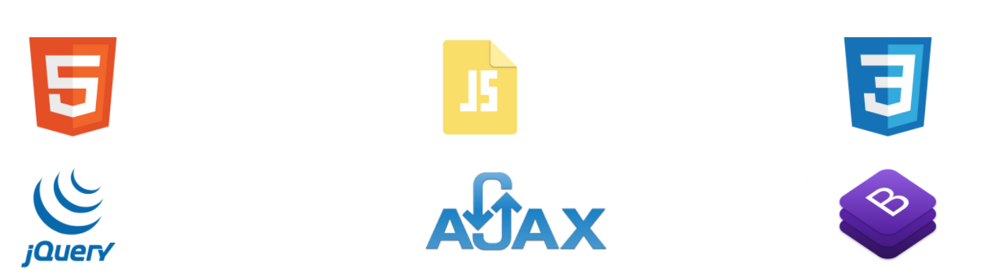
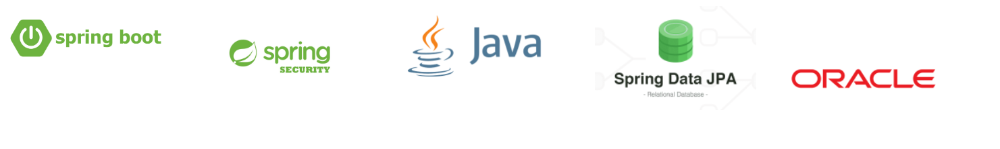

더 자세한 내용이 궁금하시다면?! : [관리를 부탁해](https://www.notion.so/c5422121f77a4cbaa35678d491d4f046)

# 프로젝트 명

관리를 부탁해

# 프로젝트 소개

카페 프렌차이즈를 대상으로 한 카페 재고 및 운영관리 플랫폼입니다.

# 프로젝트를 진행하게 된 이유

매일 가던 프렌차이즈 카페에서 프랜차이즈 운영에 대한 궁금증이 생겨 진행하게 되었습니다.

 프랜차이즈 본사의 효율적인 지점 관리와 프랜차이즈 본사의 관리 시스템을 빠르고 효율적으로 이식 할 수 있고 , 매장 관리를 효율적이고 체계적으로 할 수 있게 지원할 수 있는 프로그램을 개발해 보고자 진행하였습니다.

# 프로젝트 수행 인원

- 프로젝트 매니저 - 1명
- 형상관리자 - 1명
- 산출물 관리자 - 1명
- 테스터 - 1명
- 서버 관리자 - 1명
- 데이터베이스 관리자 -  2명 (담당)
- 총 인원 : 7명

# 주요 기능

클릭 시 상세 내용을 확인할 수 있습니다!  
***

 > 재고관리

- 물품을 등록, 수정, 삭제를 할 수 있습니다. 
- 바코드를 생성해줌으로써 관리의 효율성을 증대시켰습니다. 
- 거래처를 입력하고 입,출고 관리를 할 수 있습니다. 
- 과거 히스토리 내역을 확인함으로써 합리적인 의사결정을 할 수 있습니다. 
- 재고 분석을 함으로써 합리적인 재고생산계획을 세울 수 있습니다.

***

 > 본사 발주 관리 (담당 기능)

- 본사 직원은 원하는 상품을 원하는 수량만큼 발주합니다.  
- 검색을 통해 발주 가능한 상품을 조회할 수 있습니다.  
- 같은 상품에 대해 본사와 계약한 거래처를 선택할 수 있습니다.  
- 발주 신청 후 거래처와 합의 후 발주 처리 상태를 변경할 수 있습니다.

***

 > 가맹점 발주 관리 (담당 기능)

- 가맹점 직원은 원하는 상품을 원하는 수량만큼 발주합니다.  
- 발주 신청 가능 물품 목록을 조회할 수 있습니다.  
- 각 물품에 대한 설명과 이미지를 조회할 수 있습니다.  
- 본사 직원은 가맹점 발주에 대해 승인 처리 할 수 있습니다.  
- 가맹점은 발주 받은 물품에 대해 문제가 존재할 경우 이슈를 제기할 수 있습니다.  
- 본사 직원은 가맹점이 제기한 이슈에 대해 확인하고 교환 처리해 줄 수 있습니다.

***

 > 메뉴 관리

- 본사는 메뉴를 등록, 수정, 삭제, 상세보기를 할 수 있고 가맹점은 메뉴를 상세보기 할 수 있습니다.  
- 메뉴를 생성해줌으로써 메뉴의 원재료를 조회할 수 있습니다.  
- 가맹점은 원재료를 조회함으로써 발주 목록을 구성할 수 있습니다.

***

 > 입고 관리

- 입고 관리 내 본사의 발주 버튼을 클릭하면 본사 발주 내역을 조회합니다.  
- 본사 발주 “승인 완료” 처리 된 정보를 조회하여 해당 물품을 입고 목록에 추가합니다.  
- 입고 목록 등록된 물품을 “입고 완료” 처리 시 처리 날짜가 등록됩니다.  
- “입고 완료” 시 재고 관리 내 재고 수량이 추가되어 반영됩니다.  
- “입고 완료” 시 재고 변경 내역에 정보가 추가됩니다.  
- 재고 관리에서 해당 물품의 재고를 조회할 수 있습니다.  
- 재고 변동 내역에서 재고의 입,출고 내역을 조회할 수 있습니다.

***

 > 출고 관리

- 출고할 발주 목록을 조회할 수 있습니다.  
- 승인 완료된 발주 목록을 조회하여 출고 목록에 추가할 수 있습니다.  
- 출고 목록에서 발주 상세 정보를 조회할 수 있습니다.  
- 발주 상세 정보에서 발주할 물품의 정보들을 조회할 수 있습니다.  
- 발주 상세 정보에서 해당 발주에 대한 출고 처리상태를 수정할 수 있습니다.  
- 출고 내역을 조회할 수 있습니다.

***

 > 직원 계정 관리

- 프로그램을 사용하는 본사 직원 계정의 통합적 관리를 할 수 있습니다.  
- 본사 관리자는 본사 직원 계정 생성을 할 수 있습니다.  
- 본사 관리자는 본사 직원 계정 목록을 조회 할 수 있습니다.   
- 본사 관리자는 본사 직원 계정 정보를 수정 할 수 있습니다.  
- 본사 관리자는 본사 직원 계정을 삭제 할 수 있습니다.  
- 본사 관리자는 삭제된 복사 직원 계정을 복구 할 수 있습니다.

***

 > 가맹점 계정 관리

- 프로그램을 사용하는 가맹점 대표자(점주), 직원 계정의 통합적 관리를 할 수 있습니다.  
- 본사 관리자와 본사 가맹 계약팀 직원은 가맹점 대표자, 직원 계정 생성을 할 수 있습니다.  
- 본사 관리자와 본사 가맹 계약팀 직원은 가맹점 대표자, 직원 계정 목록을 조회 할 수 있습니다.  
- 본사 관리자와 본사 가맹 계약팀 직원은 가맹점 대표자, 직원 계정 정보를 수정 할 수 있습니다.  
- 본사 관리자는 가맹점 대표자, 직원 계정을 삭제 할 수 있습니다.  
- 본사 관리자는 삭제된 가맹점 대표자, 직원 계정을 복구 할 수 있습니다.

***

 > 자재 관리

- 본사와, 가맹점이 발주 넣을 수 있는 자재를 생성할 수 있습니다.  
- 거래처와 본사의 제품을 일치 시키는 매핑을 할 수 있습니다.  
- 매핑된 제품을 목록  조회 할 수 있습니다.  
- 자재 정보를 수정할 수 있습니다.  
- 자재 정보를 삭제할 수 있습니다.  
- 매핑할 거래처 목록을 불러 올 수 있습니다.  
- 매핑할 자재 목록을 불러 올 수 있습니다.

***

 > 거래처 관리

- 신규 거래처를 등록하고 계약 상태를 조회할 수 있습니다.  
- 거래처 계약상품을 등록하고 관리할 수 있습니다. 

***

 > 백로그 관리

- 입고와 이슈출고의 데이터를 종합적으로 조회할 수 있습니다.  
- 물품당 이슈발생 빈도와 각 물품 구매량 증/감소율 막대그래프를 통해 명시적으로 상태를 확인할 수 있고, 수발주 및 입출고 계획을 구상할 수 있습니다.

# 개발환경

|   구분    |                        사용도구/언어                         |
| :-------: | :----------------------------------------------------------: |
|    DB     |            Oracle DBeaver SQLDeveloper             |
| Language  |                            Java11                            |
| 형상관리  |                    Gitlab Sourcetree                    |
|   FRONT   |      HTML5 CSS3 JavaScript JQuery 3.6.0       |
|  Library  | ojdbc8 spring-security-crpyto:5.6.2 spring-data-jpa:2.6.3 |
|   Tool    |                   Intellij IDEA Maven                   |
| FrameWork |                   Spring Spring boot                    |

***

### Front

***

### Back

***

### Tool

***

### 형상관리

***

